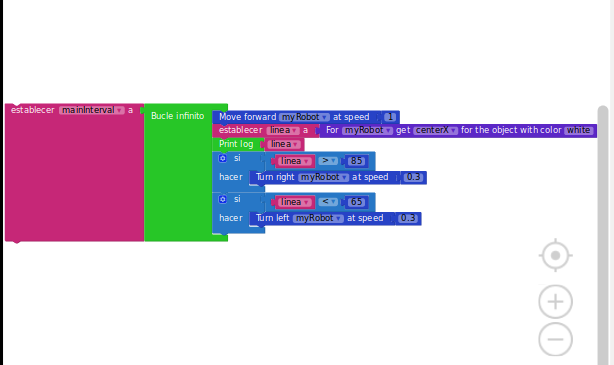

# 2019-tfg-ruben-alvarez

Semana 1  

Emulado el TFG de (Álvaro Paniagua)[https://github.com/RoboticsURJC-students/2018-tfg-alvaro_paniagua] y puesto a funcionar se han realizado varias pruebas:

[https://youtu.be/wujvLw0Btnw][Follow line en Websim]

